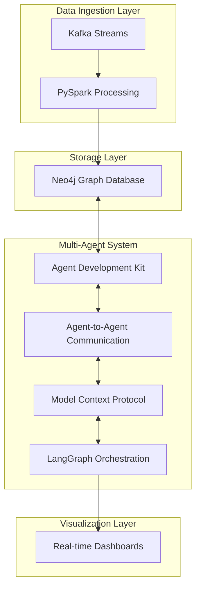
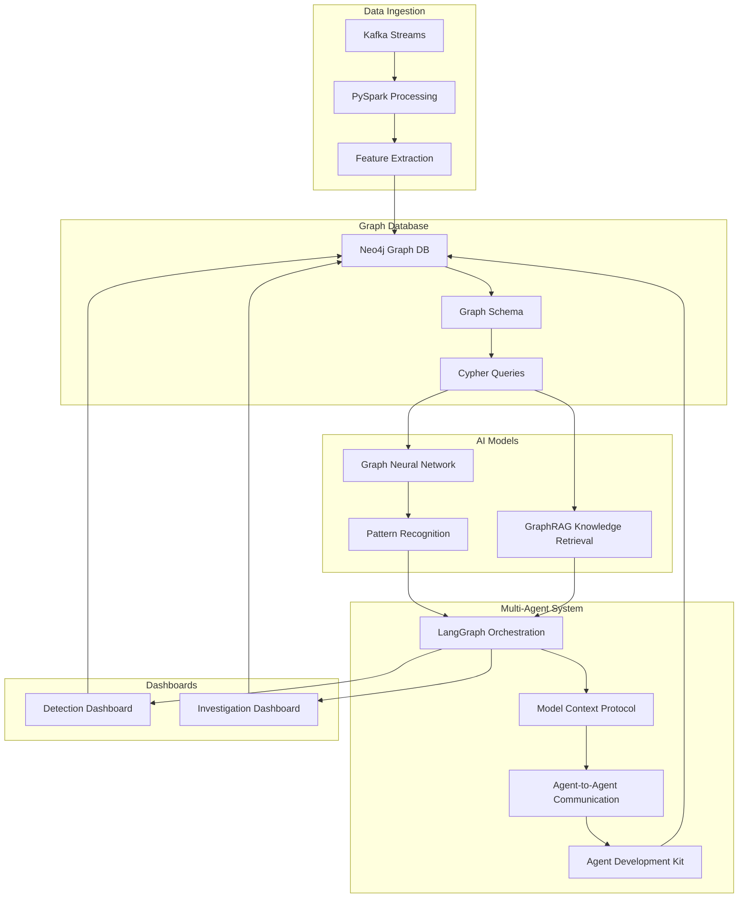
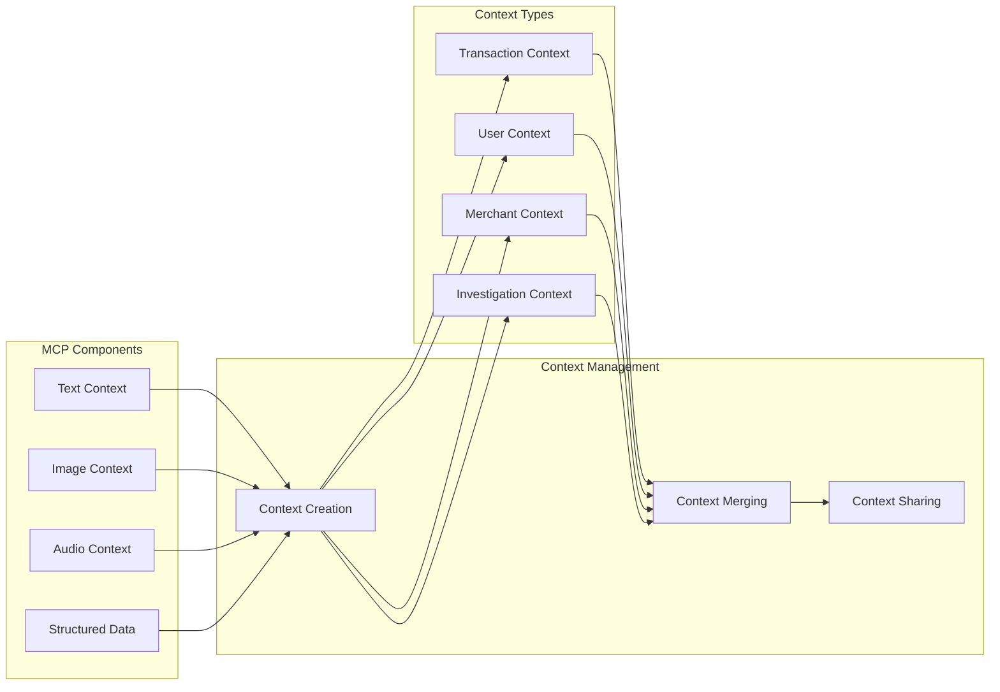
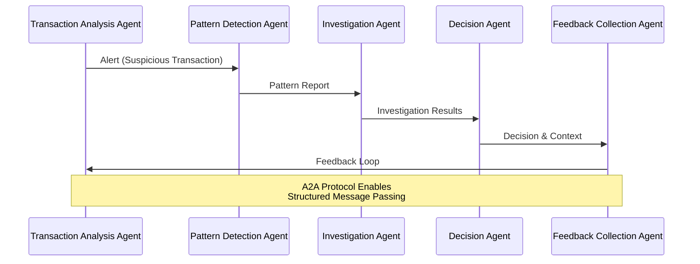
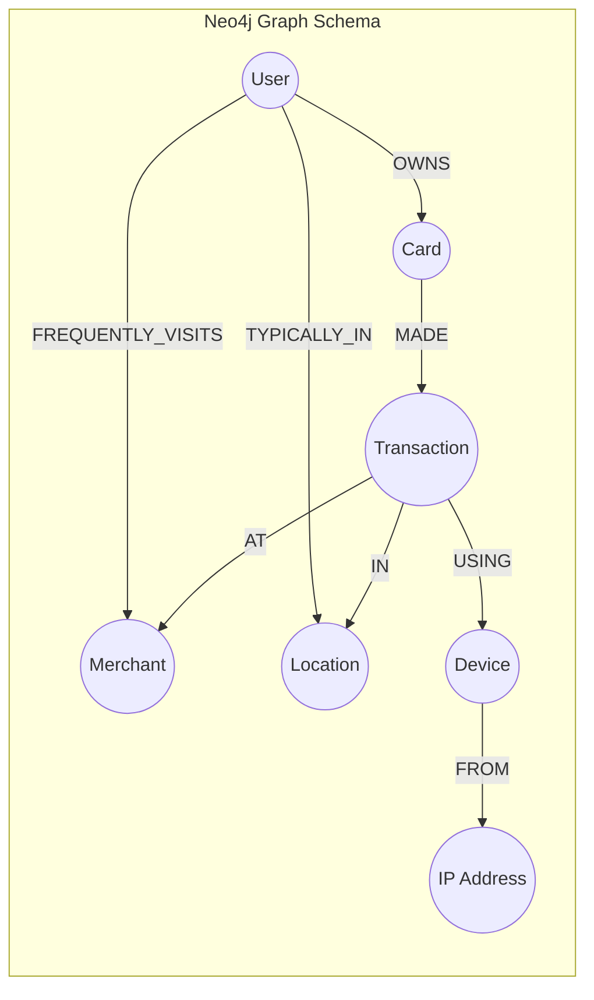
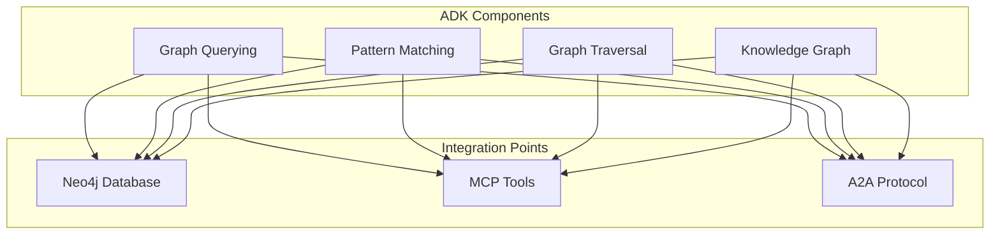
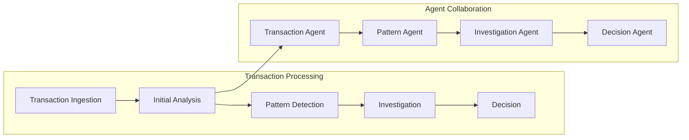

# Credit Card Fraud Detection System

A real-time fraud detection system using multi-agent architecture, Model Context Protocol (MCP), Agent-to-Agent (A2A) communication, and Neo4j graph database integration.

## System Architecture



## End-to-End Data Flow



## Model Context Protocol (MCP) Architecture



## Agent-to-Agent (A2A) Communication Flow



## Neo4j Fraud Graph Integration



## Agent Development Kit (ADK) Integration



## Real-time Fraud Detection Flow



## Key Features

1. **Real-time Transaction Processing**
   - Kafka-based transaction ingestion
   - PySpark for large-scale data processing
   - Neo4j for graph-based storage and analysis

2. **Multi-Agent System**
   - LangGraph for agent orchestration
   - Model Context Protocol for multi-modal context handling
   - Agent-to-Agent communication for collaboration
   - Agent Development Kit for Neo4j integration

3. **Fraud Detection Capabilities**
   - Transaction pattern analysis
   - User behavior monitoring
   - Merchant risk assessment
   - Graph-based pattern detection
   - Real-time investigation tools

4. **Visualization and Monitoring**
   - Real-time transaction monitoring
   - Fraud pattern visualization
   - Agent interaction visualization
   - Investigation results dashboard

## Getting Started

1. Install dependencies:
```bash
pip install -r requirements.txt
```

2. Set up Neo4j database:
```bash
python src/neo4j/setup_database.py
```

3. Start the fraud detection pipeline:
```bash
python src/multi_agent/fraud_detection_agents.py
```

4. Access the dashboards:
```bash
python src/dashboard/fraud_investigation.py
```

## Deployment Instructions

### Prerequisites

- Python 3.8+
- Java 11+ (for Kafka and Neo4j)
- Docker and Docker Compose
- Git

### Local Deployment

1. **Clone the repository**:
   ```bash
   git clone https://github.com/your-username/credit-card-fraud-detection.git
   cd credit-card-fraud-detection
   ```

2. **Set up virtual environment**:
   ```bash
   python -m venv venv
   source venv/bin/activate  # On Windows: venv\Scripts\activate
   ```

3. **Install dependencies**:
   ```bash
   pip install -r requirements.txt
   ```

4. **Configure environment variables**:
   ```bash
   cp .env.example .env
   # Edit .env file with your configuration
   ```

5. **Start Kafka using Docker**:
   ```bash
   docker-compose -f src/kafka/docker-compose.yml up -d
   ```

6. **Set up Neo4j database**:
   ```bash
   # Start Neo4j using Docker
   docker-compose -f src/neo4j/docker-compose.yml up -d
   
   # Wait for Neo4j to start, then initialize the database
   python src/neo4j/setup_database.py
   ```

7. **Generate test data** (optional):
   ```bash
   python data/generate_test_data.py
   ```

8. **Start the fraud detection pipeline**:
   ```bash
   python src/multi_agent/fraud_detection_agents.py
   ```

9. **Access the dashboards**:
   ```bash
   # In a new terminal
   python src/dashboard/fraud_investigation.py
   ```

### Production Deployment

#### Docker-based Deployment

1. **Build Docker images**:
   ```bash
   docker-compose build
   ```

2. **Deploy the entire system**:
   ```bash
   docker-compose up -d
   ```

3. **Monitor logs**:
   ```bash
   docker-compose logs -f
   ```

#### Kubernetes Deployment

1. **Create Kubernetes namespace**:
   ```bash
   kubectl create namespace fraud-detection
   ```

2. **Apply Kubernetes configurations**:
   ```bash
   kubectl apply -f k8s/ -n fraud-detection
   ```

3. **Verify deployment**:
   ```bash
   kubectl get pods -n fraud-detection
   ```

4. **Access the dashboards**:
   ```bash
   kubectl port-forward svc/fraud-investigation-dashboard 8501:8501 -n fraud-detection
   ```

### Cloud Deployment

#### AWS Deployment

1. **Set up AWS credentials**:
   ```bash
   aws configure
   ```

2. **Deploy using AWS CDK**:
   ```bash
   cd aws
   cdk deploy
   ```

#### Azure Deployment

1. **Login to Azure**:
   ```bash
   az login
   ```

2. **Deploy using Azure CLI**:
   ```bash
   az deployment group create --resource-group fraud-detection-rg --template-file azure/main.bicep
   ```

#### GCP Deployment

1. **Set up GCP credentials**:
   ```bash
   gcloud auth login
   ```

2. **Deploy using Terraform**:
   ```bash
   cd gcp
   terraform init
   terraform apply
   ```

### Scaling and Monitoring

1. **Scale Kafka**:
   ```bash
   docker-compose -f src/kafka/docker-compose.yml up -d --scale kafka=3
   ```

2. **Scale PySpark workers**:
   ```bash
   docker-compose -f src/pyspark/docker-compose.yml up -d --scale worker=5
   ```

3. **Monitor system metrics**:
   ```bash
   # Access Prometheus dashboard
   kubectl port-forward svc/prometheus-server 9090:9090 -n monitoring
   
   # Access Grafana dashboard
   kubectl port-forward svc/grafana 3000:3000 -n monitoring
   ```

4. **Set up alerts**:
   ```bash
   # Configure alert rules in Prometheus
   kubectl apply -f monitoring/alert-rules.yaml -n monitoring
   ```

## Documentation

For detailed documentation, please refer to:
- [System Architecture](documentation.md)
- [Multi-Agent Interaction](diagrams/multi_agent_interaction.md)
- [Data Flow](diagrams/data_flow.md)
- [Neo4j Integration](neo4j_research.md)
- [A2A Protocol](a2a_research.md)
- [ADK Capabilities](adk_research.md)

## License

This project is licensed under the Apache License 2.0 - see the [LICENSE](LICENSE) file for details.

```
Copyright 2025 Credit Card Fraud Detection System

Licensed under the Apache License, Version 2.0 (the "License");
you may not use this file except in compliance with the License.
You may obtain a copy of the License at

    http://www.apache.org/licenses/LICENSE-2.0

Unless required by applicable law or agreed to in writing, software
distributed under the License is distributed on an "AS IS" BASIS,
WITHOUT WARRANTIES OR CONDITIONS OF ANY KIND, either express or implied.
See the License for the specific language governing permissions and
limitations under the License. 